# QuillTip - Publishing Platform with Micro-tips on Stellar

## Executive Summary

QuillTip transforms digital content monetization by enabling readers to tip writers as little as 1 cent ($0.01) for specific highlighted text. Built exclusively on Stellar, it's the world's first platform where readers can financially appreciate individual sentences or paragraphs that resonate with them.

## The Problem

Current content platforms fail both writers and readers:

- **Writers**: Lose 30-50% to platform fees, wait 30+ days for payment, lack true content ownership
- **Readers**: Forced to pay $5+ minimums when they just want to show small appreciation
- **Global Access**: Millions of talented writers in developing countries can't monetize due to payment barriers

## Why Only Stellar Makes This Possible

| Blockchain | Transaction Fee | % of 1¢ Tip | Viable? | Source |
|------------|----------------|-------------|---------|---------|
| Base | $0.0994 | 9.9x | ❌ | [Token Terminal](https://tokenterminal.com/explorer/projects/base/metrics/transaction-fee-average) |
| Ethereum | $1.30 | 130x | ❌ | [Token Terminal](https://tokenterminal.com/explorer/projects/ethereum/metrics/transaction-fee-average) |
| Solana | $0.004 | 40% | ❌ | [Token Terminal](https://tokenterminal.com/explorer/projects/solana/metrics/transaction-fee-average) |
| Stellar | $0.0014 | 14% | ✅ | [Lumen Loop - Data Feed on X](https://x.com/StellarDataFeed/status/1947100477629641053) |

> **Result: Only Stellar enables sustainable as low as 1-cent micro-tips**

## Competitive Landscape

| Platform | Blockchain | Minimum Payment | Key Features | Highlight-to-Tip? |
|----------|------------|----------------|--------------|-------------------|
| Paragraph.xyz | Base | ~$1+ | NFT minting, subscriptions, newsletters | ❌ |
| Mirror.xyz | Ethereum | 0.00069 ETH (~$2.50) | NFT articles, crowdfunding | ❌ |
| Access Protocol | Solana | Subscription-based | Gated content, creator pools | ❌ |
| QuillTip | Stellar | $0.01 in USDC / XLM| Micropayments, heat maps, instant payout | ✅ |

**Key Differences:**

- **QuillTip**: Only platform enabling 1-cent tips for specific text selections
- **Others**: Focus on NFT minting, subscriptions, or gated content - no micropayment support
- **Innovation**: QuillTip's highlight-to-tip creates reader engagement impossible on high-fee chains

## Core Innovation: Highlight-to-Tip

QuillTip transforms reading into an interactive experience:

1. Reader highlights any text (word, sentence, paragraph)
2. Tips instantly with two clicks (starting at 1¢)
3. Writer receives 97.5% in 5 seconds
4. Heat maps show which content earns most

## Simplified Architecture

## Micropayment Flow

```mermaid
sequenceDiagram
    participant Reader
    participant QuillTip
    participant SmartContract
    participant Stellar
    participant Writer
    
    Reader->>QuillTip: Highlights text & tips 1¢
    QuillTip->>SmartContract: Process micropayment
    
    Note over SmartContract: Split payment:<br/>97.5% to writer<br/>2.5% platform fee
    
    SmartContract->>Stellar: Transfer $0.00975 to writer
    SmartContract->>Stellar: Transfer $0.00025 to platform
    
    Note over Stellar: Total cost: $0.01 + $0.0014 fee<br/>Only viable on Stellar!
    
    Stellar-->>Writer: Payment received<br/>(5 seconds)
    Writer->>Writer: Instant notification
```

## Viral Mechanics & Growth

- **Heat Maps**: Visual feedback showing most-tipped section
- **Leaderboards**: Gamification for both readers and writers
- **Social Highlights**: Share and discover great content
- **Progressive Wallet**: Start tipping without crypto knowledge
- **Tip Streaks**: Encourage regular tipping

## Global Impact

QuillTip democratizes content monetization worldwide:

- **No Minimum Payout**: Every cent counts
- **True Ownership**: Articles stored as NFTs on-chain
- **MoneyGram Integration**: Cash out in 200+ countries
- **Language Agnostic**: Starting with English, expanding to Hindi, Spanish, and more

## Business Model

- **Sustainable**: 2.5% platform fee on all transactions
- **Scalable**: Marginal profit even on 1-cent tips
- **Network Effects**: More writers → more readers → more writers

## Current Status & Milestones

- ✅ Technical architecture complete
- ✅ Smart contract design finalized
- ✅ UI/UX mockups ready
- 🔄 MVP development (8 weeks)
- 📅 Beta launch with 20 writers
- 📅 Scale to 1,000 writers in 3 months

## Summary

QuillTip is building the future of content monetization - one that's only possible on Stellar. By enabling 1-cent micro-tips, we're creating a new economy where quality content is rewarded at the paragraph level, writers earn instantly, and readers can show appreciation affordably.

**The magic: A reader in India can tip a writer in Nigeria 1 cent, and the writer receives it in 5 seconds.**