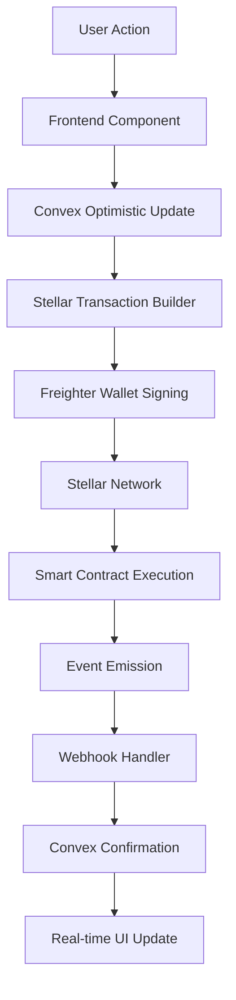

# 🎯 Article NFT System Implementation Plan

Based on thorough analysis of the QuillTip codebase, approximately **60% of the NFT infrastructure already exists**. This plan efficiently builds upon the existing foundation to create a complete NFT ecosystem.

## ✅ What Already Exists

### Smart Contracts
- Basic NFT contract in Rust (`contracts/article-nft/src/lib.rs`)
- Tip threshold validation for minting eligibility
- Transfer functionality with ownership tracking
- Article-to-NFT mapping to prevent duplicate mints

### Frontend Components
- `MintButton.tsx` - NFT minting interface
- `NFTBadge.tsx` - Visual NFT indicators
- `TransferModal.tsx` - NFT transfer UI
- `NFTIntegration.tsx` - Main NFT management component

### Backend Infrastructure
- Convex functions for NFT operations (`convex/nfts.ts`)
- Database schema with NFT tables (`articleNFTs`, `nftTransfers`)
- Stellar wallet integration via Freighter
- Tip tracking system for NFT eligibility

## 📋 Implementation Phases

### Phase 1: Contract Deployment & Enhanced NFT System (2-3 days)

#### 1.1 Deploy Existing NFT Contract to Stellar
- Build and optimize the Rust contract
- Deploy to Stellar testnet using Soroban CLI
- Store contract ID in environment variables
- Create deployment script for automation

#### 1.2 Enhance NFT Contract with Royalties
```rust
// Add to article-nft/src/lib.rs
pub struct NFTToken {
    // ... existing fields
    pub royalty_bps: u32,        // Royalty in basis points (500 = 5%)
    pub original_author: Address, // For perpetual royalties
}
```

#### 1.3 Update Frontend Integration
- Connect `MintButton` to deployed contract
- Add transaction signing via Freighter
- Update NFT status queries to check blockchain
- Implement proper loading states and error handling

### Phase 2: Marketplace Integration (3-4 days)

#### 2.1 Create Marketplace Smart Contract
```rust
// contracts/marketplace/src/lib.rs
pub struct Listing {
    pub nft_id: u64,
    pub seller: Address,
    pub price: i128,
    pub royalty_recipient: Address,
    pub royalty_bps: u32,
}

impl MarketplaceContract {
    pub fn list_nft(env: Env, nft_id: u64, price: i128) -> u64;
    pub fn buy_nft(env: Env, listing_id: u64, buyer: Address) -> bool;
    pub fn make_offer(env: Env, nft_id: u64, offer_amount: i128) -> u64;
    pub fn cancel_listing(env: Env, listing_id: u64) -> bool;
}
```

#### 2.2 Build Marketplace UI
- Create `/marketplace` route with NFT listings
- Implement filtering (price, author, popularity)
- Add NFT detail view with ownership history
- Build buy/sell/transfer interfaces

#### 2.3 Integrate with Convex
```typescript
// convex/schema.ts additions
nftListings: defineTable({
  nftId: v.id("articleNFTs"),
  sellerId: v.id("users"),
  priceUsd: v.number(),
  priceCents: v.number(),
  status: v.string(), // ACTIVE, SOLD, CANCELLED
  listedAt: v.number(),
  soldAt: v.optional(v.number()),
}),

nftOffers: defineTable({
  nftId: v.id("articleNFTs"),
  offererId: v.id("users"),
  amountUsd: v.number(),
  status: v.string(), // PENDING, ACCEPTED, REJECTED, EXPIRED
  expiresAt: v.number(),
  createdAt: v.number(),
}),
```

### Phase 3: Enhanced Ownership & History (2 days)

#### 3.1 Ownership Verification System
- On-chain ownership validation
- NFT holder benefits:
  - Ad-free reading experience
  - Access to exclusive content
  - Verified NFT owner badge
  - Early access to new features

#### 3.2 Complete History Tracking
- Implement blockchain event listeners
- Store all transfers in Convex with transaction details
- Create provenance chain visualization
- Track price appreciation over time

### Phase 4: Granular Tipping Integration (1 day)

#### 4.1 Link NFTs with Granular Tips
- Show heat map overlay on NFT articles
- Display which sections earned most tips
- Calculate NFT rarity based on tip distribution
- Implement bonus royalties for highly-tipped sections

#### 4.2 Dynamic NFT Metadata
```typescript
// lib/stellar/nft-metadata.ts
interface DynamicNFTMetadata {
  baseRarity: 'common' | 'uncommon' | 'rare' | 'epic' | 'legendary';
  tipHeatmap: {
    sectionId: string;
    tipAmount: number;
    percentage: number;
  }[];
  totalTipsReceived: number;
  uniqueTippers: number;
  lastUpdated: number;
}
```

## 🛠️ Technical Implementation Details

### Contract Deployment Script
```bash
#!/bin/bash
# scripts/deploy-nft.sh

# Build contract
cd contracts/article-nft
cargo build --target wasm32-unknown-unknown --release

# Optimize WASM
soroban contract optimize \
  --wasm target/wasm32-unknown-unknown/release/article_nft.wasm

# Deploy to Stellar
CONTRACT_ID=$(soroban contract deploy \
  --wasm target/wasm32-unknown-unknown/release/article_nft.wasm \
  --network testnet \
  --source $DEPLOYER_SECRET)

echo "Contract deployed with ID: $CONTRACT_ID"
echo "Add to .env: STELLAR_NFT_CONTRACT_ID=$CONTRACT_ID"

# Initialize contract
soroban contract invoke \
  --id $CONTRACT_ID \
  --source $DEPLOYER_SECRET \
  --network testnet \
  -- initialize \
  --admin $ADMIN_ADDRESS \
  --tip_threshold 100000000
```

### Key Integration Points

#### Stellar Services (`lib/stellar/nft.ts`)
```typescript
import { Contract, Networks, TransactionBuilder } from '@stellar/stellar-sdk';

export class NFTService {
  private contract: Contract;

  async mintNFT(
    authorAddress: string,
    articleId: string,
    tipAmount: string,
    metadataUrl: string
  ): Promise<string> {
    // Build and submit mint transaction
  }

  async transferNFT(
    from: string,
    to: string,
    tokenId: number
  ): Promise<string> {
    // Build and submit transfer transaction
  }

  async checkOwnership(
    tokenId: number,
    address: string
  ): Promise<boolean> {
    // Query contract for ownership
  }
}
```

#### Environment Variables
```env
# Stellar Configuration
STELLAR_NFT_CONTRACT_ID=
STELLAR_MARKETPLACE_CONTRACT_ID=
STELLAR_NETWORK=testnet
STELLAR_HORIZON_URL=https://horizon-testnet.stellar.org
STELLAR_SOROBAN_RPC_URL=https://soroban-testnet.stellar.org

# NFT Configuration
DEFAULT_ROYALTY_BPS=500
MIN_TIP_THRESHOLD_USD=10
NFT_METADATA_BASE_URL=https://quilltip.com/api/nft/metadata
```

## 📊 Data Flow Architecture



## 🎯 Success Metrics

### Performance Targets
- NFT minting completed in < 5 seconds
- Marketplace transactions in < 10 seconds
- Ownership verification in < 1 second
- History queries in < 500ms

### Quality Metrics
- 100% royalty distribution accuracy
- Complete ownership history tracking
- Zero duplicate NFT mints
- Seamless integration with existing tipping

### User Experience
- One-click minting for eligible articles
- Real-time marketplace updates
- Clear ownership visualization
- Intuitive transfer process

## ⚡ Optimization Strategies

### 1. Reuse Existing Infrastructure
- 60% of components already built
- Leverage existing wallet integration
- Build on current database schema

### 2. Parallel Development
- Smart contracts and UI simultaneously
- Independent testing of each module
- Continuous integration approach

### 3. Incremental Deployment
- Phase 1: Basic NFT functionality
- Phase 2: Marketplace launch
- Phase 3: Advanced features
- Phase 4: Granular integration

### 4. Performance Optimizations
- Batch NFT operations
- Convex reactivity for real-time updates
- Lazy loading for NFT galleries
- CDN for metadata storage

### 5. Cost Optimizations
- Efficient contract storage patterns
- Minimize on-chain data
- Strategic use of IPFS/Arweave
- Batch transaction submissions

## 🔄 Compatibility with Future Features

### Granular Tipping Integration
The NFT system is designed to seamlessly integrate with the planned granular tipping feature:

1. **Coordinate Tracking**: NFT metadata will include tip coordinates
2. **Heat Maps**: Visual representation of valuable content sections
3. **Dynamic Rarity**: NFT value increases with granular tip data
4. **Enhanced Royalties**: Higher royalties for highly-tipped sections

### Data Structure for Granular Tips
```typescript
interface GranularTipData {
  nftId: string;
  tipCoordinates: {
    start: number;
    end: number;
    text: string;
    amount: number;
    tipperId: string;
  }[];
  heatmapData: number[][]; // 2D array of tip density
  totalGranularTips: number;
}
```

## 📅 Timeline Summary

- **Week 1**: Contract deployment, basic NFT operations
- **Week 2**: Marketplace development and integration
- **Week 3**: Ownership features and history tracking
- **Week 4**: Testing, optimization, and granular tip prep

## 🚀 Next Steps

1. Review and approve this implementation plan
2. Set up Stellar testnet accounts and funding
3. Begin Phase 1 contract deployment
4. Parallel UI development with mock data
5. Incremental testing and deployment

This plan ensures efficient implementation while maintaining code quality and preparing for future enhancements. The modular approach allows for flexibility and reduces risk through incremental deployment.