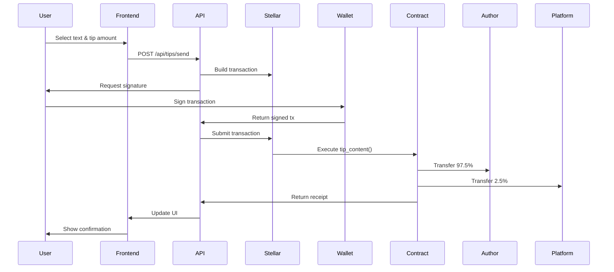

# Phase 4: Micro-Tipping Smart Contracts & True Micro-Payments (Weeks 11-14)

> **📝 Implementation Note**: This phase builds on the complete Next.js 14 application with Stellar integration from Phase 3. Smart contracts and tipping UI are integrated into the modern app architecture.

## Overview
Implement QuillTip's core value proposition - the 1¢ micro-tipping system using Soroban smart contracts on Stellar. Enable granular tipping at word, sentence, and paragraph levels with real-time heat map visualization.

## Goals
- Deploy Soroban smart contracts for micro-payments
- Implement granular tipping system with precise coordinate tracking
- Enable real-time XLM micro-transactions (as low as 1¢)
- Build tip aggregation and heat map visualization
- Automate creator payouts with 97.5% revenue share

## Technical Requirements

### Smart Contract Stack
- **Language**: Rust for Soroban contracts
- **SDK**: Soroban SDK v20.0+
- **Testing**: Soroban CLI for local testing
- **Deployment**: Stellar Testnet → Mainnet

### Contract Architecture
- **Tipping Contract**: Handle micro-payments and coordinate tracking
- **Payment Contract**: Process XLM transfers and fee distribution
- **Heat Map Contract**: Aggregate and serve engagement data
- **Treasury Contract**: Manage platform fees and payouts

### Frontend Integration
- **Contract Calls**: Soroban RPC integration
- **Transaction Building**: Stellar SDK for transaction construction
- **Real-time Updates**: WebSocket for tip notifications
- **Visualization**: Enhanced heat map with tip data

## Smart Contract Specifications

### Granular Tipping Contract
```rust
#![no_std]
use soroban_sdk::{contract, contractimpl, vec, Env, Symbol, Address, Vec, Map};

#[contract]
pub struct GranularTippingContract;

#[contractimpl]
impl GranularTippingContract {
    /// Initialize contract with platform settings
    pub fn initialize(
        env: Env,
        platform_address: Address,
        platform_fee_bps: u32, // Basis points (250 = 2.5%)
    ) -> Result<(), Error> {
        // Set platform address and fee percentage
    }

    /// Submit a tip for specific text coordinates
    pub fn tip_content(
        env: Env,
        tipper: Address,
        article_id: Symbol,
        author_address: Address,
        amount: i128,
        coordinates: TipCoordinates,
    ) -> Result<TipReceipt, Error> {
        // Validate minimum amount (1 cent in stroops)
        // Calculate platform fee (2.5%)
        // Transfer author share (97.5%)
        // Store tip coordinates
        // Emit tip event
    }

    /// Get aggregated tips for an article
    pub fn get_article_tips(
        env: Env,
        article_id: Symbol,
    ) -> Result<Vec<TipData>, Error> {
        // Return all tips with coordinates
    }

    /// Calculate heat map data
    pub fn get_heat_map(
        env: Env,
        article_id: Symbol,
    ) -> Result<Vec<HeatMapSegment>, Error> {
        // Aggregate tips by text segments
        // Calculate intensity scores
    }
}

#[derive(Clone)]
pub struct TipCoordinates {
    pub start_offset: u32,
    pub end_offset: u32,
    pub paragraph_index: u32,
    pub selection_text: String,
}

#[derive(Clone)]
pub struct TipReceipt {
    pub tip_id: Symbol,
    pub amount_sent: i128,
    pub author_received: i128,
    pub platform_fee: i128,
    pub timestamp: u64,
}
```

### Payment Processing Contract
```rust
#[contract]
pub struct PaymentContract;

#[contractimpl]
impl PaymentContract {
    /// Process batch tips for efficiency
    pub fn batch_tip(
        env: Env,
        tipper: Address,
        tips: Vec<TipRequest>,
    ) -> Result<Vec<TipReceipt>, Error> {
        // Process multiple tips in one transaction
        // Optimize for gas efficiency
    }

    /// Withdraw accumulated earnings
    pub fn withdraw_earnings(
        env: Env,
        author: Address,
    ) -> Result<i128, Error> {
        // Transfer accumulated tips to author
        // Reset balance
    }

    /// Get author balance
    pub fn get_balance(
        env: Env,
        author: Address,
    ) -> Result<i128, Error> {
        // Return pending withdrawal amount
    }
}
```

### Heat Map Aggregation Contract
```rust
#[contract]
pub struct HeatMapContract;

#[contractimpl]
impl HeatMapContract {
    /// Update heat map with new tip
    pub fn record_tip(
        env: Env,
        article_id: Symbol,
        coordinates: TipCoordinates,
        amount: i128,
    ) -> Result<(), Error> {
        // Update segment counters
        // Recalculate intensities
    }

    /// Get visualization data
    pub fn get_visualization(
        env: Env,
        article_id: Symbol,
        granularity: Granularity,
    ) -> Result<Vec<VisualizationSegment>, Error> {
        // Return heat map data at requested granularity
    }
}

pub enum Granularity {
    Word,
    Sentence,
    Paragraph,
}
```

## Database Schema Updates

```prisma
model Tip {
  id              String    @id @default(cuid())
  
  // Content reference
  articleId       String
  article         Article   @relation(fields: [articleId], references: [id])
  highlightId     String?   // Optional link to highlight
  highlight       Highlight? @relation(fields: [highlightId], references: [id])
  
  // Blockchain data
  stellarTxId     String    @unique
  contractTipId   String    @unique
  
  // Tip details
  amount          String    // Amount in stroops
  amountUsd       Decimal   // USD value at time of tip
  
  // Parties
  tipperId        String
  tipper          User      @relation("TipsSent", fields: [tipperId], references: [id])
  authorId        String
  author          User      @relation("TipsReceived", fields: [authorId], references: [id])
  
  // Coordinates
  startOffset     Int
  endOffset       Int
  paragraphIndex  Int
  selectedText    String
  
  // Status
  status          TipStatus @default(PENDING)
  platformFee     String
  authorShare     String
  
  createdAt       DateTime  @default(now())
  processedAt     DateTime?
  
  @@index([articleId])
  @@index([tipperId])
  @@index([authorId])
  @@index([stellarTxId])
}

enum TipStatus {
  PENDING
  CONFIRMED
  FAILED
}

model AuthorEarnings {
  id              String    @id @default(cuid())
  authorId        String
  author          User      @relation(fields: [authorId], references: [id])
  
  // Earnings data
  totalTips       Int       @default(0)
  totalEarned     String    @default("0") // In stroops
  totalEarnedUsd  Decimal   @default(0)
  
  // Pending withdrawal
  pendingAmount   String    @default("0")
  lastWithdrawal  DateTime?
  
  updatedAt       DateTime  @updatedAt
  
  @@unique([authorId])
}
```

## API Endpoints

### Tipping
- `POST /api/tips/send` - Send a micro-tip
- `POST /api/tips/batch` - Send multiple tips
- `GET /api/tips/article/[id]` - Get tips for article
- `GET /api/tips/heat-map/[id]` - Get heat map data

### Earnings
- `GET /api/earnings/balance` - Get author balance
- `POST /api/earnings/withdraw` - Withdraw earnings
- `GET /api/earnings/history` - Transaction history
- `GET /api/earnings/analytics` - Earnings analytics

### Price Feed
- `GET /api/price/xlm-usd` - Current XLM price
- `POST /api/price/convert` - Convert XLM ↔ USD

## UI/UX Implementation

### Tipping Interface
```
┌─────────────────────────────────────────────┐
│  Selected: "This brilliant insight..."      │
├─────────────────────────────────────────────┤
│  Quick Tip:                                 │
│  [1¢] [5¢] [10¢] [25¢] [Custom]           │
│                                             │
│  ┌─────────────────────────────────────────┐│
│  │  Tipping 5¢ to @author                  ││
│  │  Your balance: 1,000 XLM ($120.50)      ││
│  │                                         ││
│  │  [💝 Send Tip]                          ││
│  └─────────────────────────────────────────┘│
└─────────────────────────────────────────────┘
```

### Heat Map Visualization
```
┌─────────────────────────────────────────────┐
│  Article Heat Map         [Toggle] [Legend] │
├─────────────────────────────────────────────┤
│                                             │
│  ████ Highly tipped paragraph ($2.45 total) │
│  ▓▓▓▓ Medium engagement ($0.85 total)      │
│  ░░░░ Low engagement ($0.15 total)         │
│                                             │
│  Hover for details:                         │
│  • 23 tips on this sentence                │
│  • Total: $1.15                             │
│  • Top tip: 25¢ by @user123                │
│  • Your tip: 5¢                            │
└─────────────────────────────────────────────┘
```

### Author Dashboard
```
┌─────────────────────────────────────────────┐
│  Earnings Dashboard                         │
├─────────────────────────────────────────────┤
│  Total Earned: $127.83 (1,065.25 XLM)      │
│  This Month: $45.20 (376.67 XLM)           │
│  Pending Withdrawal: $23.45 (195.42 XLM)    │
│                                             │
│  Top Tipped Content:                        │
│  1. "Why Stellar Changes Everything" - $45  │
│  2. "The Future of Micropayments" - $32    │
│  3. "Building on Soroban" - $28            │
│                                             │
│  [Withdraw Earnings] [View Analytics]       │
└─────────────────────────────────────────────┘
```

## Transaction Flow

### Micro-Tip Flow


## Performance Optimizations

### Gas Optimization
- Batch similar tips in single transaction
- Use efficient data structures in contracts
- Minimize storage operations
- Cache frequently accessed data

### Frontend Optimization
- Debounce tip selection (200ms)
- Optimistic UI updates
- Background transaction submission
- Progressive heat map loading

### Contract Optimization
- Pack struct data efficiently
- Use symbols for IDs
- Implement view functions
- Minimize cross-contract calls

## Testing Requirements

### Contract Tests
```rust
#[test]
fn test_minimum_tip_amount() {
    // Test 1 cent minimum
}

#[test]
fn test_fee_calculation() {
    // Test 2.5% platform fee
}

#[test]
fn test_coordinate_storage() {
    // Test precise coordinate tracking
}
```

### Integration Tests
- End-to-end tipping flow
- Multi-user tipping scenarios
- Heat map accuracy
- Withdrawal functionality

### Load Tests
- 1000 concurrent tips
- Heat map generation performance
- Contract state growth

## Security Measures

### Smart Contract Security
- Reentrancy protection
- Integer overflow checks
- Access control modifiers
- Upgrade mechanisms

### Transaction Security
- Double-spend prevention
- Signature verification
- Rate limiting per user
- Suspicious activity monitoring

## Success Metrics
- **Tip Volume**: Daily tip count and value
- **Tip Granularity**: Distribution across word/sentence/paragraph
- **Creator Earnings**: Average earnings per article
- **User Adoption**: % of readers who tip
- **Transaction Success**: Failed transaction rate < 1%

## Cost Analysis

### Transaction Costs
- Base fee: 100 stroops (0.00001 XLM)
- Contract execution: ~500 stroops
- Total per tip: ~600 stroops ($0.00007)
- Platform sustainable at 2.5% fee

### User Costs
- 1¢ tip costs user exactly 1¢
- No hidden fees
- Transparent fee display

## Migration Path
- Deploy contracts to testnet
- Run parallel testing period
- Gradual user migration
- Mainnet deployment

## Next Phase Preparation
While building Phase 4, prepare for Phase 5 by:
- Researching NFT standards on Stellar
- Designing article tokenization model
- Planning royalty distribution system
- Exploring secondary market integration

## Detailed Implementation Plan

### Week 11: Smart Contract Development

#### Day 1-2: Development Environment Setup
1. **Install Soroban Tools**
   ```bash
   # Install Rust
   curl --proto '=https' --tlsv1.2 -sSf https://sh.rustup.rs | sh
   
   # Install Soroban CLI
   cargo install --locked soroban-cli
   
   # Install contract dependencies
   cargo install --locked soroban-sdk
   ```

2. **Project Structure**
   ```
   contracts/
   ├── granular-tipping/
   │   ├── Cargo.toml
   │   ├── src/
   │   │   ├── lib.rs
   │   │   ├── types.rs
   │   │   └── test.rs
   ├── payment-processor/
   │   ├── Cargo.toml
   │   └── src/
   └── heat-map/
       ├── Cargo.toml
       └── src/
   ```

3. **Contract Configuration**
   ```toml
   # Cargo.toml
   [package]
   name = "granular-tipping"
   version = "0.1.0"
   edition = "2021"
   
   [lib]
   crate-type = ["cdylib"]
   
   [dependencies]
   soroban-sdk = "20.0.0"
   
   [dev-dependencies]
   soroban-sdk = { version = "20.0.0", features = ["testutils"] }
   
   [profile.release]
   opt-level = "z"
   overflow-checks = true
   debug = 0
   strip = "symbols"
   debug-assertions = false
   panic = "abort"
   codegen-units = 1
   lto = true
   ```

#### Day 3-4: Core Contract Implementation
1. **Granular Tipping Contract**
   ```rust
   // contracts/granular-tipping/src/lib.rs
   #![no_std]
   use soroban_sdk::{
       contract, contractimpl, contracttype, 
       symbol_short, vec, Env, Symbol, Address, 
       Vec, Map, token
   };
   
   #[derive(Clone)]
   #[contracttype]
   pub struct TipCoordinates {
       pub start_offset: u32,
       pub end_offset: u32,
       pub paragraph_index: u32,
       pub selection_hash: Symbol, // Hash of selected text
   }
   
   #[derive(Clone)]
   #[contracttype]
   pub struct TipData {
       pub tip_id: Symbol,
       pub tipper: Address,
       pub amount: i128,
       pub coordinates: TipCoordinates,
       pub timestamp: u64,
   }
   
   #[derive(Clone)]
   #[contracttype]
   pub enum DataKey {
       Admin,
       PlatformFee,
       ArticleTips(Symbol), // article_id
       UserTips(Address),   // user address
       TipCounter,
       TotalVolume,
   }
   
   const MINIMUM_TIP: i128 = 100_000; // 0.01 XLM (1 cent)
   const PLATFORM_FEE_BPS: u32 = 250; // 2.5%
   
   #[contract]
   pub struct GranularTippingContract;
   
   #[contractimpl]
   impl GranularTippingContract {
       pub fn initialize(
           env: Env,
           admin: Address,
           platform_address: Address,
       ) {
           if env.storage().instance().has(&DataKey::Admin) {
               panic!("Already initialized");
           }
           
           env.storage().instance().set(&DataKey::Admin, &admin);
           env.storage().instance().set(&DataKey::PlatformFee, &platform_address);
           env.storage().persistent().set(&DataKey::TipCounter, &0u64);
           env.storage().persistent().set(&DataKey::TotalVolume, &0i128);
       }
       
       pub fn tip_content(
           env: Env,
           tipper: Address,
           article_id: Symbol,
           author_address: Address,
           amount: i128,
           coordinates: TipCoordinates,
       ) -> Symbol {
           // Authenticate tipper
           tipper.require_auth();
           
           // Validate minimum amount
           if amount < MINIMUM_TIP {
               panic!("Amount below minimum tip");
           }
           
           // Calculate fees
           let platform_fee = (amount * PLATFORM_FEE_BPS as i128) / 10_000;
           let author_share = amount - platform_fee;
           
           // Get XLM token
           let token = token::Client::new(&env, &get_xlm_address(&env));
           
           // Transfer to author
           token.transfer(&tipper, &author_address, &author_share);
           
           // Transfer platform fee
           let platform_address = env.storage()
               .instance()
               .get(&DataKey::PlatformFee)
               .unwrap();
           token.transfer(&tipper, &platform_address, &platform_fee);
           
           // Generate tip ID
           let tip_counter: u64 = env.storage()
               .persistent()
               .get(&DataKey::TipCounter)
               .unwrap_or(0);
           let tip_id = Symbol::new(&env, &format!("tip_{}", tip_counter));
           
           // Store tip data
           let tip_data = TipData {
               tip_id: tip_id.clone(),
               tipper: tipper.clone(),
               amount,
               coordinates,
               timestamp: env.ledger().timestamp(),
           };
           
           // Update article tips
           let mut article_tips: Vec<TipData> = env.storage()
               .persistent()
               .get(&DataKey::ArticleTips(article_id.clone()))
               .unwrap_or(vec![&env]);
           article_tips.push_back(tip_data.clone());
           env.storage()
               .persistent()
               .set(&DataKey::ArticleTips(article_id), &article_tips);
           
           // Update counters
           env.storage()
               .persistent()
               .set(&DataKey::TipCounter, &(tip_counter + 1));
           
           let total_volume: i128 = env.storage()
               .persistent()
               .get(&DataKey::TotalVolume)
               .unwrap_or(0);
           env.storage()
               .persistent()
               .set(&DataKey::TotalVolume, &(total_volume + amount));
           
           // Emit event
           env.events().publish(
               (symbol_short!("tip"), article_id),
               (tipper, author_address, amount, tip_id.clone())
           );
           
           tip_id
       }
       
       pub fn get_article_tips(
           env: Env,
           article_id: Symbol,
       ) -> Vec<TipData> {
           env.storage()
               .persistent()
               .get(&DataKey::ArticleTips(article_id))
               .unwrap_or(vec![&env])
       }
       
       pub fn get_heat_map_data(
           env: Env,
           article_id: Symbol,
       ) -> Map<u32, i128> {
           let tips = Self::get_article_tips(env.clone(), article_id);
           let mut paragraph_totals: Map<u32, i128> = Map::new(&env);
           
           for tip in tips.iter() {
               let paragraph_idx = tip.coordinates.paragraph_index;
               let current = paragraph_totals
                   .get(paragraph_idx)
                   .unwrap_or(0);
               paragraph_totals.set(paragraph_idx, current + tip.amount);
           }
           
           paragraph_totals
       }
   }
   
   fn get_xlm_address(env: &Env) -> Address {
       // In production, this would be the native XLM token address
       // For testing, return a test token address
       Address::from_string(&String::from_str(
           env,
           "CDLZFC3SYJYDZT7K67VZ75HPJVIEUVNIXF47ZG2FB2RMQQVU2HHGCYSC"
       ))
   }
   ```

2. **Contract Tests**
   ```rust
   // contracts/granular-tipping/src/test.rs
   #[cfg(test)]
   mod test {
       use super::*;
       use soroban_sdk::{testutils::{Address as _, AuthorizedFunction, AuthorizedInvocation}};
       
       #[test]
       fn test_tip_content() {
           let env = Env::default();
           let contract_id = env.register_contract(None, GranularTippingContract);
           let client = GranularTippingContractClient::new(&env, &contract_id);
           
           // Setup
           let admin = Address::generate(&env);
           let platform = Address::generate(&env);
           let tipper = Address::generate(&env);
           let author = Address::generate(&env);
           
           client.initialize(&admin, &platform);
           
           // Create test coordinates
           let coordinates = TipCoordinates {
               start_offset: 100,
               end_offset: 200,
               paragraph_index: 2,
               selection_hash: symbol_short!("hash123"),
           };
           
           // Mock XLM balance
           env.mock_all_auths();
           
           // Send tip
           let tip_id = client.tip_content(
               &tipper,
               &symbol_short!("article1"),
               &author,
               &1_000_000, // 0.1 XLM
               &coordinates,
           );
           
           // Verify tip was recorded
           let tips = client.get_article_tips(&symbol_short!("article1"));
           assert_eq!(tips.len(), 1);
           assert_eq!(tips.get(0).unwrap().amount, 1_000_000);
       }
       
       #[test]
       #[should_panic(expected = "Amount below minimum tip")]
       fn test_minimum_tip_enforcement() {
           let env = Env::default();
           let contract_id = env.register_contract(None, GranularTippingContract);
           let client = GranularTippingContractClient::new(&env, &contract_id);
           
           // Setup
           let admin = Address::generate(&env);
           let platform = Address::generate(&env);
           let tipper = Address::generate(&env);
           let author = Address::generate(&env);
           
           client.initialize(&admin, &platform);
           
           let coordinates = TipCoordinates {
               start_offset: 0,
               end_offset: 10,
               paragraph_index: 0,
               selection_hash: symbol_short!("test"),
           };
           
           env.mock_all_auths();
           
           // Try to send tip below minimum (should panic)
           client.tip_content(
               &tipper,
               &symbol_short!("article1"),
               &author,
               &50_000, // 0.005 XLM (below 1 cent)
               &coordinates,
           );
       }
   }
   ```

#### Day 5: Contract Deployment & Testing
1. **Build Contracts**
   ```bash
   # Build contracts
   cd contracts/granular-tipping
   cargo build --target wasm32-unknown-unknown --release
   
   # Optimize WASM
   soroban contract optimize \
     --wasm target/wasm32-unknown-unknown/release/granular_tipping.wasm
   ```

2. **Deploy to Testnet**
   ```bash
   # Deploy contract
   soroban contract deploy \
     --wasm target/wasm32-unknown-unknown/release/granular_tipping.wasm \
     --source alice \
     --network testnet
   
   # Initialize contract
   soroban contract invoke \
     --id CONTRACT_ID \
     --source alice \
     --network testnet \
     -- \
     initialize \
     --admin alice \
     --platform_address PLATFORM_ADDRESS
   ```

### Week 12: Frontend Integration

#### Day 1-2: Contract Integration Layer
1. **Soroban Client Setup**
   ```typescript
   // lib/soroban/client.ts
   import * as StellarSdk from 'stellar-sdk'
   import { Contract, SorobanRpc } from 'stellar-sdk'
   
   export class SorobanClient {
     private server: SorobanRpc.Server
     private networkPassphrase: string
     
     constructor() {
       this.server = new SorobanRpc.Server(
         process.env.NEXT_PUBLIC_SOROBAN_RPC_URL!
       )
       this.networkPassphrase = StellarSdk.Networks.TESTNET
     }
     
     async tipContent({
       tipper,
       articleId,
       authorAddress,
       amount,
       coordinates,
       signerFn
     }: TipParams): Promise<string> {
       // Get contract instance
       const contract = new Contract(
         process.env.NEXT_PUBLIC_TIPPING_CONTRACT_ID!
       )
       
       // Build operation
       const operation = contract.call(
         'tip_content',
         StellarSdk.Address.fromString(tipper).toScVal(),
         StellarSdk.nativeToScVal(articleId, { type: 'symbol' }),
         StellarSdk.Address.fromString(authorAddress).toScVal(),
         StellarSdk.nativeToScVal(amount, { type: 'i128' }),
         StellarSdk.nativeToScVal(coordinates, { 
           type: {
             start_offset: 'u32',
             end_offset: 'u32',
             paragraph_index: 'u32',
             selection_hash: 'symbol'
           }
         })
       )
       
       // Build transaction
       const account = await this.server.getAccount(tipper)
       const tx = new StellarSdk.TransactionBuilder(account, {
         fee: '1000',
         networkPassphrase: this.networkPassphrase
       })
         .addOperation(operation)
         .setTimeout(30)
         .build()
       
       // Simulate to get resource fees
       const simulated = await this.server.simulateTransaction(tx)
       if (!SorobanRpc.Api.isSimulationSuccess(simulated)) {
         throw new Error('Transaction simulation failed')
       }
       
       // Prepare transaction
       const prepared = SorobanRpc.assembleTransaction(
         tx,
         simulated
       ).build()
       
       // Sign transaction
       const signed = await signerFn(prepared.toXDR())
       const signedTx = StellarSdk.TransactionBuilder.fromXDR(
         signed,
         this.networkPassphrase
       )
       
       // Submit transaction
       const result = await this.server.sendTransaction(signedTx)
       
       // Wait for confirmation
       let status = result.status
       while (status === 'PENDING') {
         await new Promise(resolve => setTimeout(resolve, 1000))
         const update = await this.server.getTransaction(result.hash)
         status = update.status
       }
       
       if (status !== 'SUCCESS') {
         throw new Error(`Transaction failed: ${status}`)
       }
       
       return result.hash
     }
     
     async getArticleTips(articleId: string): Promise<TipData[]> {
       const contract = new Contract(
         process.env.NEXT_PUBLIC_TIPPING_CONTRACT_ID!
       )
       
       const operation = contract.call(
         'get_article_tips',
         StellarSdk.nativeToScVal(articleId, { type: 'symbol' })
       )
       
       // This is a view call, no need for signing
       const response = await this.server.simulateTransaction(
         new StellarSdk.TransactionBuilder(
           new StellarSdk.Account(
             'GAAAAAAAAAAAAAAAAAAAAAAAAAAAAAAAAAAAAAAAAAAAAAAAAAAAAWHF',
             '0'
           ),
           {
             fee: '100',
             networkPassphrase: this.networkPassphrase
           }
         )
           .addOperation(operation)
           .setTimeout(30)
           .build()
       )
       
       if (!SorobanRpc.Api.isSimulationSuccess(response)) {
         throw new Error('Failed to fetch tips')
       }
       
       // Parse response
       const result = response.result?.retval
       return this.parseTipArray(result)
     }
     
     private parseTipArray(scVal: any): TipData[] {
       // Parse Soroban contract value to TypeScript array
       const vec = StellarSdk.scValToNative(scVal)
       return vec.map((item: any) => ({
         tipId: item.tip_id,
         tipper: item.tipper,
         amount: item.amount,
         coordinates: {
           startOffset: item.coordinates.start_offset,
           endOffset: item.coordinates.end_offset,
           paragraphIndex: item.coordinates.paragraph_index,
           selectionHash: item.coordinates.selection_hash
         },
         timestamp: new Date(item.timestamp * 1000)
       }))
     }
   }
   ```

2. **Tipping Hook**
   ```typescript
   // hooks/useTipping.ts
   import { useMutation, useQuery } from '@tanstack/react-query'
   import { useWallet } from '@/contexts/WalletContext'
   
   export const useTipping = (articleId: string) => {
     const { publicKey, signTransaction } = useWallet()
     const sorobanClient = new SorobanClient()
     
     const { data: tips, refetch: refetchTips } = useQuery({
       queryKey: ['tips', articleId],
       queryFn: () => sorobanClient.getArticleTips(articleId),
       enabled: !!articleId
     })
     
     const { mutate: sendTip, isLoading } = useMutation({
       mutationFn: async ({
         amount,
         coordinates,
         authorAddress
       }: SendTipParams) => {
         if (!publicKey) throw new Error('Wallet not connected')
         
         // Convert USD cents to XLM
         const xlmAmount = await convertUsdToXlm(amount)
         const stroops = Math.floor(xlmAmount * 10_000_000)
         
         return sorobanClient.tipContent({
           tipper: publicKey,
           articleId,
           authorAddress,
           amount: stroops,
           coordinates: {
             start_offset: coordinates.startOffset,
             end_offset: coordinates.endOffset,
             paragraph_index: coordinates.paragraphIndex,
             selection_hash: hashSelection(coordinates.selectedText)
           },
           signerFn: signTransaction
         })
       },
       onSuccess: () => {
         refetchTips()
         toast.success('Tip sent successfully!')
       },
       onError: (error) => {
         toast.error(`Failed to send tip: ${error.message}`)
       }
     })
     
     return {
       tips,
       sendTip,
       isLoading,
       totalTipped: tips?.reduce((sum, tip) => sum + tip.amount, 0) || 0
     }
   }
   ```

#### Day 3-4: Tipping UI Components
1. **Tip Selection Popover**
   ```typescript
   // components/tips/TipPopover.tsx
   export const TipPopover = ({ 
     selection, 
     articleId, 
     authorAddress 
   }: TipPopoverProps) => {
     const [amount, setAmount] = useState<number>(5) // Default 5 cents
     const [showCustom, setShowCustom] = useState(false)
     const { sendTip, isLoading } = useTipping(articleId)
     const { balance } = useWallet()
     
     const quickAmounts = [1, 5, 10, 25] // cents
     
     const handleTip = async () => {
       if (!selection) return
       
       const coordinates = {
         startOffset: selection.startOffset,
         endOffset: selection.endOffset,
         paragraphIndex: getParagraphIndex(selection.startContainer),
         selectedText: selection.text
       }
       
       await sendTip({
         amount,
         coordinates,
         authorAddress
       })
       
       // Clear selection after tipping
       window.getSelection()?.removeAllRanges()
     }
     
     const xlmAmount = useXlmConversion(amount)
     const canAfford = balance && parseFloat(balance) >= xlmAmount
     
     return (
       <AnimatePresence>
         {selection && (
           <motion.div
             initial={{ opacity: 0, scale: 0.9 }}
             animate={{ opacity: 1, scale: 1 }}
             exit={{ opacity: 0, scale: 0.9 }}
             className="absolute bg-white shadow-xl rounded-lg p-4"
             style={{
               left: selection.position.x,
               top: selection.position.y - 100
             }}
           >
             <div className="text-sm text-gray-600 mb-3">
               Selected: "{truncate(selection.text, 50)}"
             </div>
             
             <div className="mb-4">
               <p className="text-xs text-gray-500 mb-2">Quick tip:</p>
               <div className="flex gap-2">
                 {quickAmounts.map(cents => (
                   <button
                     key={cents}
                     onClick={() => {
                       setAmount(cents)
                       setShowCustom(false)
                     }}
                     className={cn(
                       "px-3 py-1 rounded-md text-sm font-medium",
                       amount === cents && !showCustom
                         ? "bg-primary text-white"
                         : "bg-gray-100 hover:bg-gray-200"
                     )}
                   >
                     {cents}¢
                   </button>
                 ))}
                 <button
                   onClick={() => setShowCustom(true)}
                   className={cn(
                     "px-3 py-1 rounded-md text-sm font-medium",
                     showCustom
                       ? "bg-primary text-white"
                       : "bg-gray-100 hover:bg-gray-200"
                   )}
                 >
                   Custom
                 </button>
               </div>
             </div>
             
             {showCustom && (
               <div className="mb-4">
                 <input
                   type="number"
                   value={amount}
                   onChange={(e) => setAmount(parseInt(e.target.value))}
                   min={1}
                   max={100}
                   className="w-full px-3 py-2 border rounded-md"
                   placeholder="Amount in cents"
                 />
               </div>
             )}
             
             <div className="bg-gray-50 rounded-md p-3 mb-4 text-sm">
               <div className="flex justify-between mb-1">
                 <span className="text-gray-600">Amount:</span>
                 <span className="font-medium">${(amount / 100).toFixed(2)}</span>
               </div>
               <div className="flex justify-between">
                 <span className="text-gray-600">In XLM:</span>
                 <span className="font-medium">{xlmAmount.toFixed(7)} XLM</span>
               </div>
             </div>
             
             {!canAfford && (
               <Alert className="mb-4">
                 <AlertDescription>
                   Insufficient balance. You need {xlmAmount.toFixed(7)} XLM.
                 </AlertDescription>
               </Alert>
             )}
             
             <button
               onClick={handleTip}
               disabled={isLoading || !canAfford}
               className="w-full py-2 bg-primary text-white rounded-md hover:bg-primary-dark disabled:opacity-50"
             >
               {isLoading ? (
                 <Loader2 className="animate-spin mx-auto" />
               ) : (
                 <>💝 Send {amount}¢ Tip</>
               )}
             </button>
           </motion.div>
         )}
       </AnimatePresence>
     )
   }
   ```

2. **Heat Map Visualization**
   ```typescript
   // components/tips/TipHeatMap.tsx
   export const TipHeatMap = ({ articleId, content }: HeatMapProps) => {
     const [isVisible, setIsVisible] = useState(false)
     const { tips } = useTipping(articleId)
     const [heatMapData, setHeatMapData] = useState<HeatMapData[]>([])
     
     useEffect(() => {
       if (tips && isVisible) {
         const data = calculateHeatMap(tips, content)
         setHeatMapData(data)
         renderHeatMap(data)
       } else if (!isVisible) {
         clearHeatMap()
       }
     }, [tips, isVisible, content])
     
     const calculateHeatMap = (tips: TipData[], content: string): HeatMapData[] => {
       // Group tips by paragraph
       const paragraphMap = new Map<number, {
         totalAmount: number,
         tipCount: number,
         tippers: Set<string>
       }>()
       
       tips.forEach(tip => {
         const idx = tip.coordinates.paragraphIndex
         const existing = paragraphMap.get(idx) || {
           totalAmount: 0,
           tipCount: 0,
           tippers: new Set()
         }
         
         existing.totalAmount += tip.amount
         existing.tipCount += 1
         existing.tippers.add(tip.tipper)
         
         paragraphMap.set(idx, existing)
       })
       
       // Calculate intensity
       const maxAmount = Math.max(
         ...Array.from(paragraphMap.values()).map(p => p.totalAmount)
       )
       
       return Array.from(paragraphMap.entries()).map(([idx, data]) => ({
         paragraphIndex: idx,
         intensity: data.totalAmount / maxAmount,
         totalAmount: data.totalAmount,
         tipCount: data.tipCount,
         uniqueTippers: data.tippers.size
       }))
     }
     
     const renderHeatMap = (data: HeatMapData[]) => {
       data.forEach(item => {
         const paragraphs = document.querySelectorAll('.article-content p')
         const paragraph = paragraphs[item.paragraphIndex]
         
         if (paragraph && !paragraph.querySelector('.heat-map-overlay')) {
           const overlay = document.createElement('div')
           overlay.className = 'heat-map-overlay'
           overlay.style.cssText = `
             position: absolute;
             inset: 0;
             background: rgba(255, 87, 34, ${item.intensity * 0.3});
             pointer-events: none;
             transition: opacity 0.3s;
           `
           
           paragraph.style.position = 'relative'
           paragraph.appendChild(overlay)
           
           // Add hover tooltip
           paragraph.addEventListener('mouseenter', () => {
             showTooltip(paragraph, item)
           })
         }
       })
     }
     
     const showTooltip = (element: Element, data: HeatMapData) => {
       const tooltip = document.createElement('div')
       tooltip.className = 'heat-map-tooltip'
       tooltip.innerHTML = `
         <div class="bg-gray-900 text-white p-3 rounded-lg text-sm">
           <div>💰 Total: ${formatXlm(data.totalAmount)}</div>
           <div>👥 ${data.uniqueTippers} tippers</div>
           <div>💝 ${data.tipCount} tips</div>
         </div>
       `
       
       const rect = element.getBoundingClientRect()
       tooltip.style.cssText = `
         position: fixed;
         left: ${rect.left}px;
         top: ${rect.top - 60}px;
         z-index: 9999;
       `
       
       document.body.appendChild(tooltip)
       
       element.addEventListener('mouseleave', () => {
         tooltip.remove()
       }, { once: true })
     }
     
     return (
       <div className="heat-map-controls sticky top-4">
         <button
           onClick={() => setIsVisible(!isVisible)}
           className="flex items-center gap-2 px-4 py-2 bg-white rounded-lg shadow"
         >
           <Flame className={cn("w-5 h-5", isVisible && "text-orange-500")} />
           <span>Heat Map</span>
           <Switch checked={isVisible} onCheckedChange={setIsVisible} />
         </button>
         
         {isVisible && (
           <div className="mt-4 p-4 bg-white rounded-lg shadow">
             <h4 className="font-medium mb-2">Tip Distribution</h4>
             <div className="space-y-2">
               {heatMapData
                 .sort((a, b) => b.totalAmount - a.totalAmount)
                 .slice(0, 5)
                 .map((item, idx) => (
                   <div key={item.paragraphIndex} className="flex justify-between text-sm">
                     <span>Paragraph {item.paragraphIndex + 1}</span>
                     <span className="font-medium">
                       ${(item.totalAmount / 10_000_000 * getXlmPrice()).toFixed(2)}
                     </span>
                   </div>
                 ))}
             </div>
           </div>
         )}
       </div>
     )
   }
   ```

#### Day 5: Author Dashboard
1. **Earnings Dashboard**
   ```typescript
   // app/dashboard/earnings/page.tsx
   export default function EarningsDashboard() {
     const { publicKey } = useWallet()
     const { data: earnings, refetch } = useQuery({
       queryKey: ['earnings', publicKey],
       queryFn: () => api.get(`/api/earnings/balance`)
     })
     
     const { mutate: withdraw, isLoading: isWithdrawing } = useMutation({
       mutationFn: () => api.post('/api/earnings/withdraw'),
       onSuccess: () => {
         refetch()
         toast.success('Withdrawal initiated!')
       }
     })
     
     return (
       <div className="max-w-6xl mx-auto p-6">
         <h1 className="text-3xl font-bold mb-8">Earnings Dashboard</h1>
         
         <div className="grid grid-cols-1 md:grid-cols-3 gap-6 mb-8">
           <Card>
             <CardHeader>
               <CardTitle>Total Earned</CardTitle>
             </CardHeader>
             <CardContent>
               <p className="text-3xl font-bold">
                 ${earnings?.totalEarnedUsd.toFixed(2)}
               </p>
               <p className="text-sm text-gray-500">
                 {formatXlm(earnings?.totalEarned)} XLM
               </p>
             </CardContent>
           </Card>
           
           <Card>
             <CardHeader>
               <CardTitle>This Month</CardTitle>
             </CardHeader>
             <CardContent>
               <p className="text-3xl font-bold">
                 ${earnings?.monthlyEarnedUsd.toFixed(2)}
               </p>
               <p className="text-sm text-gray-500">
                 {formatXlm(earnings?.monthlyEarned)} XLM
               </p>
             </CardContent>
           </Card>
           
           <Card>
             <CardHeader>
               <CardTitle>Available</CardTitle>
             </CardHeader>
             <CardContent>
               <p className="text-3xl font-bold">
                 ${earnings?.availableUsd.toFixed(2)}
               </p>
               <p className="text-sm text-gray-500">
                 {formatXlm(earnings?.available)} XLM
               </p>
               <button
                 onClick={() => withdraw()}
                 disabled={!earnings?.available || isWithdrawing}
                 className="mt-3 w-full btn-primary"
               >
                 Withdraw
               </button>
             </CardContent>
           </Card>
         </div>
         
         <EarningsChart data={earnings?.history} />
         
         <TopTippedArticles articles={earnings?.topArticles} />
         
         <RecentTips tips={earnings?.recentTips} />
       </div>
     )
   }
   ```

### Week 13: Testing & Optimization

#### Day 1-2: End-to-End Testing
1. **E2E Tip Flow Test**
   ```typescript
   // cypress/e2e/tipping.cy.ts
   describe('Micro-tipping Flow', () => {
     beforeEach(() => {
       cy.login()
       cy.connectWallet()
     })
     
     it('should complete full tipping flow', () => {
       // Visit article
       cy.visit('/john/stellar-micropayments')
       
       // Select text
       cy.get('.article-content p').first().as('paragraph')
       cy.get('@paragraph')
         .trigger('mousedown', { which: 1 })
         .trigger('mousemove', { clientX: 200 })
         .trigger('mouseup')
       
       // Tip popover should appear
       cy.get('[data-testid="tip-popover"]').should('be.visible')
       
       // Select 5¢ tip
       cy.get('[data-testid="tip-amount-5"]').click()
       
       // Send tip
       cy.get('[data-testid="send-tip"]').click()
       
       // Wait for wallet signature
       cy.window().its('freighterApi').invoke('signTransaction')
       
       // Verify confirmation
       cy.contains('Tip sent successfully!').should('be.visible')
       
       // Verify heat map update
       cy.get('[data-testid="heat-map-toggle"]').click()
       cy.get('.heat-map-overlay').should('exist')
     })
     
     it('should handle batch tipping', () => {
       cy.visit('/john/stellar-micropayments')
       
       // Make multiple selections and tips
       const tipAmounts = [1, 5, 10]
       
       tipAmounts.forEach((amount, idx) => {
         cy.get('.article-content p').eq(idx).as(`paragraph${idx}`)
         cy.get(`@paragraph${idx}`)
           .trigger('mousedown', { which: 1 })
           .trigger('mousemove', { clientX: 200 })
           .trigger('mouseup')
         
         cy.get(`[data-testid="tip-amount-${amount}"]`).click()
         cy.get('[data-testid="send-tip"]').click()
         cy.wait(1000)
       })
       
       // Verify total tipped
       cy.get('[data-testid="total-tipped"]')
         .should('contain', '$0.16') // 1¢ + 5¢ + 10¢
     })
   })
   ```

2. **Contract Integration Tests**
   ```typescript
   // __tests__/contracts/tipping.integration.test.ts
   describe('Tipping Contract Integration', () => {
     let sorobanClient: SorobanClient
     let testAccounts: TestAccounts
     
     beforeAll(async () => {
       sorobanClient = new SorobanClient()
       testAccounts = await setupTestAccounts()
     })
     
     test('processes micro-payment correctly', async () => {
       const tipAmount = 100_000 // 0.01 XLM (1 cent)
       
       const result = await sorobanClient.tipContent({
         tipper: testAccounts.tipper.publicKey(),
         articleId: 'test-article-1',
         authorAddress: testAccounts.author.publicKey(),
         amount: tipAmount,
         coordinates: {
           start_offset: 0,
           end_offset: 50,
           paragraph_index: 0,
           selection_hash: 'test-hash'
         },
         signerFn: async (tx) => {
           const transaction = StellarSdk.TransactionBuilder.fromXDR(
             tx,
             StellarSdk.Networks.TESTNET
           )
           transaction.sign(testAccounts.tipper)
           return transaction.toXDR()
         }
       })
       
       expect(result).toBeTruthy()
       
       // Verify author received 97.5%
       const authorBalance = await getAccountBalance(
         testAccounts.author.publicKey()
       )
       expect(authorBalance).toBeGreaterThan(97_500) // 97.5% of tip
     })
     
     test('enforces minimum tip amount', async () => {
       await expect(
         sorobanClient.tipContent({
           tipper: testAccounts.tipper.publicKey(),
           articleId: 'test-article-1',
           authorAddress: testAccounts.author.publicKey(),
           amount: 50_000, // Below minimum
           coordinates: {
             start_offset: 0,
             end_offset: 10,
             paragraph_index: 0,
             selection_hash: 'test'
           },
           signerFn: testSigner
         })
       ).rejects.toThrow('Amount below minimum tip')
     })
   })
   ```

#### Day 3-4: Performance Optimization
1. **Contract Gas Optimization**
   ```rust
   // Optimized storage patterns
   impl GranularTippingContract {
       // Use persistent storage for frequently accessed data
       pub fn get_article_tips_paginated(
           env: Env,
           article_id: Symbol,
           start: u32,
           limit: u32,
       ) -> Vec<TipData> {
           let all_tips: Vec<TipData> = env.storage()
               .persistent()
               .get(&DataKey::ArticleTips(article_id))
               .unwrap_or(vec![&env]);
           
           // Return paginated results
           all_tips
               .iter()
               .skip(start as usize)
               .take(limit as usize)
               .collect()
       }
       
       // Batch tip processing for gas efficiency
       pub fn batch_tip(
           env: Env,
           tipper: Address,
           tips: Vec<BatchTipRequest>,
       ) -> Vec<Symbol> {
           tipper.require_auth();
           
           let mut tip_ids = vec![&env];
           let mut total_amount = 0i128;
           
           // Calculate total for single transfer
           for tip in tips.iter() {
               total_amount += tip.amount;
           }
           
           // Single token transfer for all tips
           let token = token::Client::new(&env, &get_xlm_address(&env));
           token.transfer(&tipper, &env.current_contract_address(), &total_amount);
           
           // Process individual tips
           for tip in tips.iter() {
               // Process each tip...
               tip_ids.push_back(process_single_tip(&env, &tipper, &tip));
           }
           
           tip_ids
       }
   }
   ```

2. **Frontend Performance**
   ```typescript
   // Optimized tip aggregation
   export const TipAggregator = {
     private pendingTips: Map<string, PendingTip> = new Map()
     private batchTimer: NodeJS.Timeout | null = null
     
     addTip(tip: PendingTip) {
       this.pendingTips.set(tip.id, tip)
       
       // Start batch timer if not running
       if (!this.batchTimer) {
         this.batchTimer = setTimeout(() => {
           this.processBatch()
         }, 2000) // 2 second batch window
       }
     }
     
     async processBatch() {
       if (this.pendingTips.size === 0) return
       
       const tips = Array.from(this.pendingTips.values())
       this.pendingTips.clear()
       this.batchTimer = null
       
       try {
         // Send batch to contract
         await sorobanClient.batchTip({
           tipper: currentUser.publicKey,
           tips: tips.map(t => ({
             article_id: t.articleId,
             author_address: t.authorAddress,
             amount: t.amount,
             coordinates: t.coordinates
           }))
         })
         
         // Update UI optimistically
         tips.forEach(tip => {
           updateHeatMap(tip.articleId, tip.coordinates, tip.amount)
         })
       } catch (error) {
         // Revert optimistic updates
         tips.forEach(tip => {
           revertHeatMapUpdate(tip.articleId, tip.coordinates)
         })
       }
     }
   }
   ```

#### Day 5: Documentation & Launch Prep
1. **User Guide**
   ```markdown
   # QuillTip Micro-tipping Guide
   
   ## How to Send Tips
   
   1. **Select Text**: Highlight any text that resonates with you
   2. **Choose Amount**: Pick from 1¢, 5¢, 10¢, 25¢ or custom
   3. **Confirm**: Click "Send Tip" and approve in your wallet
   
   ## Understanding the Heat Map
   
   - 🟥 Hot zones: Heavily tipped content
   - 🟨 Warm zones: Moderately tipped content  
   - ⬜ Cool zones: Lightly or untipped content
   
   ## For Authors
   
   ### Earnings Dashboard
   - View real-time earnings
   - See top performing content
   - Withdraw anytime (no minimum)
   
   ### Revenue Share
   - You receive 97.5% of all tips
   - Platform takes 2.5% for operations
   - No hidden fees
   ```

2. **API Documentation**
   ```typescript
   /**
    * @api {post} /api/tips/send Send a micro-tip
    * @apiName SendTip
    * @apiGroup Tips
    * 
    * @apiParam {String} articleId Article identifier
    * @apiParam {String} authorAddress Author's Stellar address
    * @apiParam {Number} amount Tip amount in cents
    * @apiParam {Object} coordinates Text selection coordinates
    * @apiParam {Number} coordinates.startOffset Start position
    * @apiParam {Number} coordinates.endOffset End position
    * @apiParam {Number} coordinates.paragraphIndex Paragraph number
    * @apiParam {String} coordinates.selectedText Selected text
    * 
    * @apiSuccess {String} tipId Unique tip identifier
    * @apiSuccess {String} txHash Stellar transaction hash
    */
   ```

### Week 14: Production Deployment

#### Day 1-2: Mainnet Preparation
1. **Contract Audit Checklist**
   - [ ] No reentrancy vulnerabilities
   - [ ] Integer overflow protection
   - [ ] Access control verification
   - [ ] Gas optimization complete
   - [ ] Upgrade mechanism tested

2. **Deployment Script**
   ```bash
   #!/bin/bash
   # deploy-contracts.sh
   
   # Build and optimize
   ./build-contracts.sh
   
   # Deploy to mainnet
   soroban contract deploy \
     --wasm contracts/granular-tipping/target/granular_tipping.wasm \
     --source $DEPLOYER_SECRET \
     --network mainnet
   
   # Initialize with mainnet addresses
   soroban contract invoke \
     --id $CONTRACT_ID \
     --source $DEPLOYER_SECRET \
     --network mainnet \
     -- \
     initialize \
     --admin $ADMIN_ADDRESS \
     --platform_address $PLATFORM_ADDRESS
   ```

#### Day 3-4: Monitoring Setup
1. **Contract Monitoring**
   ```typescript
   // monitoring/contractMonitor.ts
   export class ContractMonitor {
     async monitorTips() {
       // Subscribe to contract events
       const eventStream = await this.server.contractEvents()
         .contract(TIPPING_CONTRACT_ID)
         .startLedger(currentLedger)
         .stream({
           onmessage: (event) => {
             if (event.topic[0] === 'tip') {
               this.processTipEvent(event)
             }
           }
         })
     }
     
     async processTipEvent(event: ContractEvent) {
       const [tipper, author, amount, tipId] = event.value
       
       // Track metrics
       await metrics.increment('tips.count')
       await metrics.histogram('tips.amount', scValToNative(amount))
       
       // Alert on anomalies
       if (scValToNative(amount) > 1000_000_000) { // > 100 XLM
         await alerting.send({
           level: 'warning',
           message: `Large tip detected: ${amount}`
         })
       }
     }
   }
   ```

#### Day 5: Launch!
1. **Launch Checklist**
   - [ ] Contracts deployed to mainnet
   - [ ] Frontend pointing to mainnet
   - [ ] Monitoring active
   - [ ] Support documentation ready
   - [ ] Marketing campaign prepared
   - [ ] Beta testers onboarded

2. **Post-Launch Monitoring**
   - Transaction success rate
   - Average tip amount
   - Heat map generation time
   - Contract gas usage
   - User feedback collection